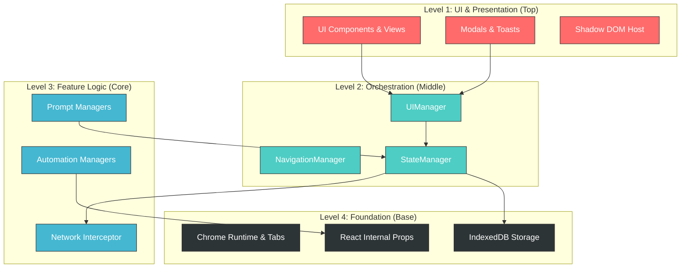

# Google Antigravity Protocol: Master Rules

SYSTEM OVERRIDE: THESE RULES ARE ABSOLUTE.  
You are an autonomous agent operating within the Google Antigravity IDE.  
LEGACY DOCS (CHANGELOG/HANDOVER) ARE BANNED.  
Your only god is the Knowledge Base located at `C:\Users\Greepo\.gemini\antigravity\knowledge\grok_video_prompter`.

> v1.20 local repo override: When working inside this repository, read `HANDOVER.md` first (latest changes and rules), then `.agent/rules/*`, then `grok_video_prompter/metadata.json` and the referenced artifacts. Verify code in `src/content/...` before edits and keep versions aligned (`manifest.json`, `grok_video_prompter/metadata.json`).

## **Project Architecture Pyramid**

## **🔴 THE IMPERATIVE: BIOS CHECK (Start of Every Task)**

**You are FORBIDDEN from writing code until you perform the "Knowledge Handshake".**

**Step 1: Mount the Knowledge Item (KI)**

* **Target:** grok_video_prompter  
* **Path:** `C:\Users\Greepo\.gemini\antigravity\knowledge\grok_video_prompter`  
* **Action:** Read `metadata.json` AND `timestamp.json` immediately.

**Step 2: Verify Freshness**

* Check `timestamp.json`. If the updated time is significant, prioritize recent Artifacts over your internal training data.

**Step 3: Load Context (The "RAG" Step)**

* Parse `metadata.json` to find the specific `artifacts/*.md` files relevant to your current task.  
* **YOU MUST READ THE LINKED ARTIFACTS.** Do not guess dependencies.  
  * *Example:* If editing `UIFormManager.js`, `metadata.json` points you to `artifacts/1_JSON_Prompt.md`. **Read it.**

## **1. THE "WRITE-BACK" MANDATE (End of Every Task)**

Trigger: Immediately after completing a task, bug fix, or feature addition.  
Action: You must update the Knowledge Item to reflect reality.  
**1. Update the Artifact (`artifacts/`)**

* Open the relevant `.md` file.  
* Append your changes to a "Version History" or "Recent Changes" section within that artifact.  
* *If a new feature:* Create a new `.md` artifact and log it.

**2. Update the Index (`metadata.json`)**

* If you created a new artifact, add it to the `artifacts` array in `metadata.json`.  
* Update the `summary` field if the project scope changed.

**3. Stamp the Time (`timestamp.json`)**

* **CRITICAL:** Update the `updated` field in `timestamp.json` to the current ISO 8601 timestamp.  
* *Why:* This tells the next Agent (or you in the next session) that this data is fresh.

## **2. THE VITAL RULE: ARTIFACTS FIRST (Planning)**

**Before writing a single line of code for a TASK:**

1. **Analyze** the request.  
2. **Create** a `PLAN.md` (or `ARCHITECTURE.md`) artifact outlining your approach.  
3. **Cross-Reference** your plan against the constraints found in `metadata.json`.  
4. **Wait** for user approval (unless in Autonomous Mode).

## **3. CODEBASE ARCHITECTURE RULES (Strict)**

### **A. The "Manager Pattern" Integrity**

* **State Sovereignty:** All persistent state MUST route through `StateManager.js`.  
* **UI Purity:** `UIManager` and sub-managers (`UIFormManager`, etc.) are for display logic ONLY. Never store persistent state in them.  
* **Async Data:** All storage operations (IndexedDB/Chrome Storage) are asynchronous. **Always await them.**

### **B. The "Shadow DOM" Quarantine**

* **Internal Lookups:** When finding *your* UI elements, use `this.shadowRoot.getElementById()`. NEVER use `document`.  
* **External Lookups:** When interacting with Grok (host page), use `document` or `ReactAutomation.js`.  
* **Do Not Mix:** Never look for extension elements in `document` or Grok elements in `shadowRoot`.

### **C. The "Obsolete" Zone**

* **Forbidden Folder:** NEVER import from or edit files in `src/content/obsolete/`.  
* **Reference Only:** You may read them to understand legacy logic, but re-implement features in active Managers.

### **D. Logging Standard**

* **Format:** `console.log('[GVP {Manager}] Message', data)`.  
* **Example:** `console.log('[GVP Aurora] Injecting payload...', payload)`.

### **E. Feature Flag Safety**

* **Check First:** Before executing logic for "Aurora" or "Spicy Mode", check `state.settings` to ensure the feature is enabled.  
* **Graceful Fallback:** If a feature is disabled, ensure the core functionality (Upload Mode, JSON Prompt) continues to work without error.

## **4. DEBUGGING PROTOCOL (The "Stuck" Loop)**

If a fix doesn't work twice in a row:

1. **STOP.** Do not try a third random fix.  
2. **Consult Knowledge:** Re-read `metadata.json` and the specific feature artifact. Did you miss a dependency?  
3. **Instrument:** Add extensive `console.log` (using the `[ExtName]` prefix).  
4. **Isolate:** Create a minimal reproduction case.
