# Upload Mode Flow & Payload Injection

> **v1.21.42** | Last Updated: 2025-12-24

This artifact documents the **exact flow** of Upload Mode and the payload structure for video generation.

---

## 🔴 v1.21.42 CRITICAL CHANGES

### Prompt Injection Pattern Changed
- **OLD:** Replace message with `firstToken + prompt`
- **NEW:** Append prompt AFTER URL: `URL PROMPT --mode=xxx`
- **File:** `gvpFetchInterceptor.js`

### Moderation Loop Fixed
- **BUG:** Moderated items were re-queued infinitely
- **FIX:** Added 3 moderation guards before any `unshift(item)` call
- **File:** `UploadAutomationManager.js` (lines 790, 840, 864)

---

## Upload Mode Flow (Canonical)

```mermaid
flowchart TD
    A["1. QUEUE ALL IMAGES<br/>User selects files → Added to queue"] --> B["2. SET UP INTERCEPTOR<br/>• Configure /new endpoint interception<br/>• Collect raw/json prompt text<br/>• Prepare spicy mode tag if enabled<br/>• Bridge to page context via postMessage"]
    B --> C["3. TAKE FIRST IMAGE FROM QUEUE<br/>Dequeue item, mark as 'processing'"]
    C --> D["4. PASTE IMAGE INTO TEXTAREA<br/>Inject file into hidden file input"]
    D --> E{"5. WAIT FOR MODERATION CHECK<br/>Image upload moderated?"}
    
    E -->|YES| F["Clear moderated card"]
    F --> GUARD["❌ v1.21.42: DON'T re-queue<br/>Move to _failedItems"]
    GUARD --> C
    
    E -->|NO| G["6. WAIT FOR NAVIGATION<br/>Grok navigates to /imagine/post/{imageId}"]
    G --> H["7. GROK SENDS /new API<br/>• Automatic (2-6 seconds)<br/>• INTERCEPTOR appends prompt after URL<br/>• INTERCEPTOR handles --mode tag"]
    H --> I["8. NAVIGATE BACK TO GALLERY<br/>Return to /imagine"]
    I --> C

    style A fill:#2d4a3e,stroke:#4ade80
    style B fill:#2d3a4a,stroke:#60a5fa
    style E fill:#4a2d2d,stroke:#f87171
    style F fill:#4a3d2d,stroke:#fbbf24
    style GUARD fill:#4a2d2d,stroke:#ef4444
    style H fill:#3d2d4a,stroke:#c084fc
```



> [!IMPORTANT]  
> **NO ERROR RETRY FROM START** - If moderated, we go back to Step 3 (next image), NOT Step 1.
> **v1.21.42:** Moderated items are NEVER re-queued. They go straight to `_failedItems`.


---

## Image URL Formats

| Type | URL Format |
|------|------------|
| **Grok-Generated** | `https://imagine-public.x.ai/imagine-public/images/{uuid}.png` |
| **User-Uploaded** | `https://assets.grok.com/users/{user-uuid}/{content-uuid}/content` |

---

## Payload Structure

### Default Payload (No Prompt, Normal Mode)

```json
{
    "temporary": true,
    "modelName": "grok-3",
    "message": "https://assets.grok.com/users/{user-uuid}/{content-uuid}/content --mode=normal",
    "fileAttachments": ["{content-uuid}"],
    "toolOverrides": { "videoGen": true },
    "responseMetadata": {
        "experiments": [],
        "modelConfigOverride": {
            "modelMap": {
                "videoGenModelConfig": {
                    "parentPostId": "{content-uuid}",
                    "aspectRatio": "1:1",
                    "videoLength": 6
                }
            }
        }
    }
}
```

### Modified Payload (Custom Prompt + Spicy Mode)

```json
{
    "temporary": true,
    "modelName": "grok-3",
    "message": "https://assets.grok.com/users/{user-uuid}/{content-uuid}/content HERE IS THE PROMPT TEXT --mode=extremely-spicy-or-crazy",
    "fileAttachments": ["{content-uuid}"],
    "toolOverrides": { "videoGen": true },
    "responseMetadata": {
        "experiments": [],
        "modelConfigOverride": {
            "modelMap": {
                "videoGenModelConfig": {
                    "parentPostId": "{content-uuid}",
                    "aspectRatio": "1:1",
                    "videoLength": 6,
                    "isVideoEdit": false
                }
            }
        }
    }
}
```

---

## Payload Injection Rules (v1.21.41+)

### Message Field Structure
```
{IMAGE_URL} {OPTIONAL_PROMPT_TEXT} --mode={MODE_TAG}
```

### Injection Logic (NEW)
```javascript
// v1.21.41+ Pattern (gvpFetchInterceptor.js)
// 1. Sanitize message (strip existing --mode token)
const sanitized = message.replace(/\s*--mode=\S+/gi, '').trim();

// 2. APPEND prompt AFTER the URL (not replace!)
base = `${sanitized} ${promptText}`.trim();

// 3. Re-add mode token at end
newMessage = `${base} --mode=xxx`;
```

### Mode Tags
| Setting | Tag |
|---------|-----|
| Normal | `--mode=normal` |
| Spicy | `--mode=extremely-spicy-or-crazy` |

---

## Prompt Bridge Mechanism

Extension and page-context interceptor communicate via `postMessage`:

```javascript
// Content script sends:
window.postMessage({
    source: 'gvp-extension',
    type: 'GVP_PROMPT_STATE',
    payload: { promptText, isRaw, timestamp }
}, '*');

// Page script stores with 6s TTL:
bridgedPrompt = { text, isRaw, ts };
```

---

## Key Files

| File | Responsibility |
|------|----------------|
| `UploadAutomationManager.js` | Queue, file injection, moderation recovery, navigation |
| `gvpFetchInterceptor.js` | Page-context /new interception, payload modification |
| `NetworkInterceptor.js` | State bridging, prompt storage |

---

## Moderation Handling (v1.21.42)

> [!CAUTION]
> **"Moderated" in Upload Mode = Image upload itself is blocked**
> 
> This is different from video generation moderation (which happens later).

### When Image is Moderated During Upload:
1. Grok shows error icon on image chip
2. We detect via DOM observer OR network response
3. `handleModerationDetected()` is called
4. Image card is cleared
5. Item moved to `_failedItems` (NOT re-queued!)
6. Process next image

### v1.21.42 Fix: Moderation Guards

Added checks at 3 locations before re-queuing:
```javascript
if (this._moderationTriggered || item.status === 'moderated') {
    this._activeItem = null;
    return; // DON'T re-queue!
}
```

---

## Version History

| Version | Date | Changes |
|---------|------|---------|
| v1.21.42 | 2025-12-24 | Fixed moderated image infinite loop (3 guards) |
| v1.21.41 | 2025-12-24 | Fixed prompt injection (append after URL) |
| v1.21.39 | 2025-12-22 | Documented flow, TTL extended to 6s |
