# Deep Dive: History Tab, Unified Storage & Quick Modes

**Version**: v1.21.44 (2025-12-25)  
**Purpose**: Detailed architectural diagrams for IndexedDB storage, History Tab data flow, and Quick Raw/JSON automation.

---

## 1. IndexedDB Unified Storage Architecture

### Database Schema


### IndexedDB Method Call Flow


---

## 2. History Tab Data Loading Flow


### Unified Entry Structure After Load


---

## 3. History Tab Rendering Flow

```mermaid
flowchart TB
    subgraph DataSource["Data Sources"]
        UNIFIED["state.unifiedHistory[]"]
        EVENT["'gvp-unified-history-loaded' event"]
        UPDATE["'gvp:multi-gen-history-update' event"]
    end
    
    subgraph Render["_renderMultiGenHistory()"]
        SORT["Sort by updatedAt DESC"]
        BUILD["_buildMultiGenCard(entry)"]
        THUMB["Resolve thumbnail<br/>(imageThumbnailUrl || thumbnailUrl)"]
        ATTEMPTS["Render attempt rows<br/>(status, progress, buttons)"]
    end
    
    subgraph Card["History Card UI"]
        IMG_THUMB["🖼️ Thumbnail"]
        VID_BTN["🎥 Play Videos"]
        NAV_BTN["📍 Navigate to Image"]
        PROMPT_BTN["📋 View Prompt"]
        STATUS["Status badges<br/>(success/pending/moderated)"]
    end
    
    DataSource --> Render
    UNIFIED --> SORT --> BUILD
    BUILD --> THUMB --> IMG_THUMB
    BUILD --> ATTEMPTS --> STATUS
    BUILD --> VID_BTN & NAV_BTN & PROMPT_BTN
    
    subgraph Navigation["Snap Navigation Logic"]
        NAV_BTN -->|Click| PUSH["history.pushState({}, '', '/imagine/post/id')"]
        PUSH --> DISPATCH["dispatchEvent(new PopStateEvent('popstate'))"]
        DISPATCH --> ROUTER["Grok Router updates view"]
        PUSH -.->|Error| FALLBACK["window.location.assign() (Reload)"]
    end
```



---

## 4. Quick Raw/JSON Complete Flow

```mermaid
flowchart TB
    subgraph Trigger["User Trigger"]
        TOGGLE["Enable Quick Raw/JSON Toggle"]
        CLICK["Click Gallery Image"]
    end
    
    subgraph Detection["Gallery Watcher (UIManager)"]
        WATCH["_initGalleryWatcher()"]
        DETECT["Detect image click"]
        CHECK{"Check quickLaunchMode"}
    end
    
    subgraph Route["_triggerQuickGeneration()"]
        JSON_PATH["Mode = 'json'"]
        RAW_PATH["Mode = 'raw'"]
    end
    
    subgraph Handlers["Generation Handlers"]
        JSON_GEN["UIFormManager.handleGenerateJson()"]
        RAW_GEN["UIRawInputManager.handleGenerateRaw()"]
    end
    
    subgraph Build["Prompt Building"]
        JSON_BUILD["buildJsonPrompt()<br/>• Categories<br/>• Fields<br/>• Presets"]
        RAW_BUILD["buildRawPrompt()<br/>• Textarea content<br/>• Templates<br/>• Silent mode suffix"]
    end
    
    subgraph Inject["ReactAutomation"]
        SEND["sendToGenerator(prompt, isRaw)"]
        TEXTAREA["Find Grok's textarea"]
        INSERT["Insert prompt text"]
        SUBMIT["Click Generate button"]
    end
    
    subgraph Return["Return to Gallery"]
        WAIT["Wait for submission"]
        ESC["_returnToGallery()"]
        CLOSE["Simulate ESC key"]
    end
    
    TOGGLE --> WATCH
    CLICK --> DETECT --> CHECK
    CHECK -->|"'json'"| JSON_PATH --> JSON_GEN --> JSON_BUILD
    CHECK -->|"'raw'"| RAW_PATH --> RAW_GEN --> RAW_BUILD
    JSON_BUILD --> SEND
    RAW_BUILD --> SEND
    SEND --> TEXTAREA --> INSERT --> SUBMIT
    SUBMIT --> WAIT --> ESC --> CLOSE
```



### Quick Raw Flow Detail


### Quick JSON Flow Detail


---

## 5. Incremental State Update Flow (v1.21.35+)

When new videos are generated, they must be added to both IndexedDB AND in-memory state:

```mermaid
flowchart TB
    subgraph Generation["Video Generation"]
        NEW["New video created"]
        STREAM["/new API stream"]
    end
    
    subgraph Intercept["NetworkInterceptor"]
        CATCH["Intercept /new response"]
        PARSE["Parse video data"]
        CREATE["Create unified entry"]
    end
    
    subgraph Persist["Dual Persistence"]
        IDB_SAVE["IndexedDBManager.saveUnifiedEntry()"]
        MEM_UPDATE["state.unifiedHistory.unshift(entry)"]
    end
    
    subgraph UI["UI Update"]
        EVENT["Dispatch 'gvp:multi-gen-history-update'"]
        RENDER["_renderMultiGenHistory()"]
        CARD["New card appears instantly"]
    end
    
    NEW --> STREAM --> CATCH --> PARSE --> CREATE
    CREATE --> IDB_SAVE
    CREATE --> MEM_UPDATE
    IDB_SAVE --> EVENT
    MEM_UPDATE --> EVENT
    EVENT --> RENDER --> CARD
    
    style MEM_UPDATE fill:#4a3d2d,stroke:#fbbf24
    
    Note over MEM_UPDATE: v1.21.35 FIX: Must update<br/>in-memory array since<br/>loadUnifiedHistory() is<br/>skipped after initial load
```

---

## 6. Key Function Reference

| Function | File | Purpose |
|----------|------|---------|
| `loadUnifiedHistory(accountId)` | StateManager.js | Load all entries from IndexedDB for account |
| `getAllUnifiedEntries(accountId)` | IndexedDBManager.js | Raw IndexedDB query |
| `saveUnifiedEntry(entry)` | IndexedDBManager.js | Save single entry |
| `_enrichUnifiedThumbnails(entries)` | StateManager.js | Backfill missing thumbnails |
| `_triggerQuickGeneration()` | UIManager.js | Route to correct handler |
| `handleGenerateRaw(options)` | UIRawInputManager.js | Build & send RAW prompt |
| `handleGenerateJson(options)` | UIFormManager.js | Build & send JSON prompt |
| `sendToGenerator(prompt, isRaw)` | ReactAutomation.js | Inject prompt to Grok UI |
| `_renderMultiGenHistory()` | UIManager.js | Render history cards |
| `buildPlaylistFromApi(filters)` | UIPlaylistManager.js | Build playlist from unified data |

---

## Version History

| Version | Date | Changes |
|---------|------|---------|
| v1.21.44 | 2025-12-25 | Initial deep-dive artifact created |
| v1.21.46 | 2025-12-25 | Added Snap Navigation logic diagram |
