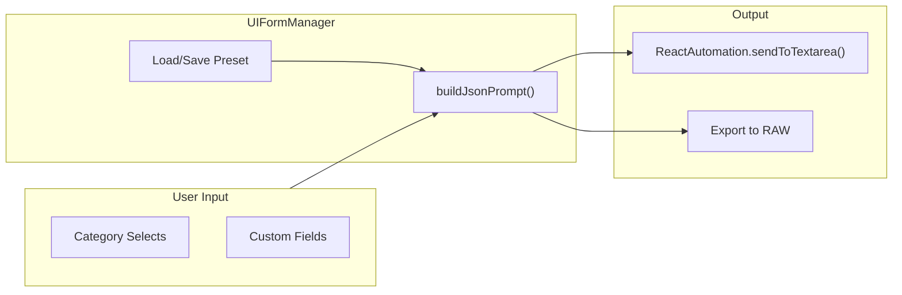

# Feature: JSON Prompt Input (Tab 1)

**Version**: v1.20 (2025-12-04)
**User Interface**: The "JSON" tab in the extension overlay.
**Goal**: structured prompt generation using dynamic forms and categories.

## JSON Prompt Flow

### v1.20 Note
- JSON prompt flow unchanged; playlist/unified storage updates do not affect this tab. Keep version in sync with manifest/metadata.

### Primary Manager: `UIFormManager.js`
-   **Location**: `src/content/managers/ui/UIFormManager.js`
-   **Responsibilities**:
    -   **Dynamic Form Generation**: Builds form fields based on a schema (categories, fields).
    -   **Preset Management**: Handles saving, loading, and updating JSON presets.
    -   **Smart Save**: Logic to determine if a preset should be created or updated.
    -   **Dropdowns**: Manages custom dropdown UIs for selecting values.
-   **Key Dependencies**:
    -   `ArrayFieldManager.js`: Handles fields that allow multiple values (arrays).
    -   `StateManager.js`: Persists preset data.

### Supporting Files
-   `ArrayFieldManager.js`: Manages dynamic lists of inputs within the form.
