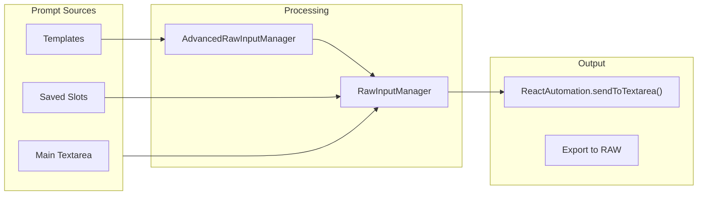

# Feature: RAW Prompt Input (Tab 2)

**Version**: v1.21.38 (2025-12-21)
**User Interface**: The "RAW" tab in the extension overlay.
**Goal**: Direct text input for prompts with template support and slot saving.

## RAW Prompt Flow

### v1.21.38 Updates (Named Prompt Slots)
- **Named Slots**: Saved prompt slots now support custom names.
  - New `name` field stored in IndexedDB via `IndexedDBManager.saveSavedPromptSlot()`
  - `StateManager.renameSavedPromptSlot(slotId, name)` - renames without altering prompt
  - UI shows custom name (or truncated prompt preview if no name set)
  - Hover tooltip shows full prompt via `title` attribute
- **Inline Rename UI**: Click ✏️ button to edit name directly on the card.
  - Enter/blur saves, Escape cancels
  - Red border styling for active edit state
- **Bug Fix**: `clearSavedPrompt()` was passing slot number instead of element to `_setSavedPromptPreview()`, causing TypeError.

### v1.20 Note
- No changes to RAW flow; version aligned with manifest/metadata. Playlist/unified storage updates do not affect this tab.

### Primary Manager: `UIRawInputManager.js`
-   **Location**: `src/content/managers/ui/UIRawInputManager.js`
-   **Responsibilities**:
    -   **Text Input**: Manages the main textarea for raw prompt entry.
    -   **Saved Slots**: Manages 4 quick-save slots for storing prompts (now with custom names).
    -   **Templates**: Integrates with the template system to insert reusable snippets.
    -   **Preview**: Generates a preview of the final prompt (processing macros/templates).
    -   **Silent Mode**: Appends silent mode suffixes if enabled.
-   **Key Dependencies**:
    -   `AdvancedRawInputManager.js`: Likely handles complex text processing/macros.
    -   `StateManager.js`: Persists saved slots (including name, prompt, timestamp).
    -   `IndexedDBManager.js`: Low-level persistence for slot data.
