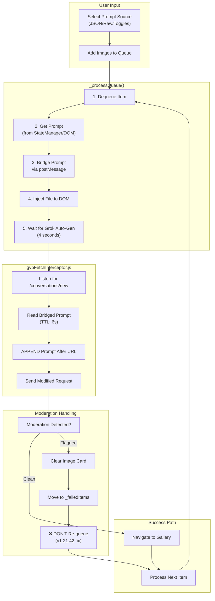
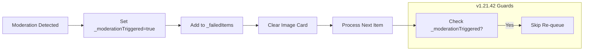

# Feature: Upload Mode (Panel)

**Version**: v1.21.42 (2025-12-24)  
**User Interface**: The "Upload" button triggers this separate panel.  
**Goal**: Automate the generation of videos from a queue of files/prompts.

---

## 🔴 v1.21.42 ARCHITECTURAL CHANGE

### How Upload Mode Now Works (New Pattern)

Upload Mode now uses the **same prompt injection pattern as `Payloadmod.js`**:

1. **User selects prompt source** (JSON preset / Raw input / Toggles)
2. **User uploads images** → added to `_queue`
3. **`_processQueue()` starts:**
   - Dequeues item
   - Bridges prompt to page context via `postMessage`
   - Injects file into Grok's file input
   - Grok auto-triggers `/conversations/new` request
4. **`gvpFetchInterceptor.js` intercepts `/conversations/new`:**
   - Reads bridged prompt (TTL: 6 seconds)
   - **APPENDS prompt AFTER the URL** (not replacing!)
   - Preserves `--mode=xxx` token at end
5. **Result payload:**
   ```
   Original: "https://assets.grok.com/.../content --mode=normal"
   Modified: "https://assets.grok.com/.../content YOUR_PROMPT --mode=normal"
   ```

### Key Files

| File | Role |
|------|------|
| `UploadAutomationManager.js` | Queue processing, file injection, moderation handling |
| `gvpFetchInterceptor.js` | Intercepts `/new`, appends prompt after URL |
| `UIUploadManager.js` | Queue UI, checkbox controls |

---

## Upload Mode Complete Flow



---

## Prompt Bridge Mechanism

The extension content script and the page-context interceptor communicate via `postMessage`:

```javascript
// Content script (UploadAutomationManager.js) sends:
window.postMessage({
    source: 'gvp-extension',
    type: 'GVP_PROMPT_STATE',
    payload: {
        promptText: 'your prompt here',
        isRaw: true,
        timestamp: Date.now()
    }
}, '*');

// Page script (gvpFetchInterceptor.js) receives and stores with 6s TTL:
bridgedPrompt = { text: promptText, isRaw: isRaw, ts: timestamp };
```

---

## Prompt Injection Logic (v1.21.41 Change)

**Old (broken):**
```javascript
const firstToken = sanitized.split(/\s+/)[0] || '';
base = (firstToken ? `${firstToken} ${promptText}` : promptText).trim();
```

**New (working):**
```javascript
// APPEND prompt AFTER the URL instead of replacing
base = `${sanitized} ${promptText}`.trim();
```

This preserves Grok's native URL and just appends the prompt text, matching the `Payloadmod.js` userscript pattern.

---

## Moderation Handling (v1.21.42 Fix)

### The Bug: Infinite Retry Loop

When an image was moderated:
1. `handleModerationDetected()` was called
2. It set `_isProcessing = false`
3. But `_processQueue()` was still running async
4. It checked `if (!this._isProcessing)` and saw "cancelled"
5. It called `this._queue.unshift(item)` → **moderated item back in queue!**
6. Loop repeats forever

### The Fix: Moderation Guards

Added checks at ALL 3 re-queue locations:

```javascript
// Before ANY re-queue, check for moderation
if (this._moderationTriggered || item.status === 'moderated') {
    console.log('[GVP Upload] Item moderated - NOT re-queuing');
    this._activeItem = null;
    return; // Exit cleanly, don't re-queue
}
```

**Locations fixed:**
- Line 790 (after file injection)
- Line 840 (after generation wait)
- Line 864 (after navigation)

### Moderation Flow



---

## Primary Manager: `UIUploadManager.js`
- **Location**: `src/content/managers/ui/UIUploadManager.js`
- **Responsibilities**:
    - **Queue UI**: Renders the list of files to be processed
    - **Status Tracking**: Shows progress (Pending, Processing, Done, Error)
    - **Controls**: Start, Pause, Clear, Cancel buttons
    - **Bulk Actions**: Toggles for "JSON", "RAW", and "Toggles" checkboxes
    - **Thumbnails**: Displays image previews for upload items

---

## Automation Logic: `UploadAutomationManager.js`
- **Location**: `src/content/managers/UploadAutomationManager.js`
- **Key Methods**:
    - `_processQueue(trigger)`: Main processing loop
    - `handleModerationDetected(data)`: Clears card, moves to `_failedItems`, triggers next
    - `_clearModeratedImageCard()`: Finds and clicks Remove button on moderated chip
    - `_injectFileIntoInput(file)`: Injects file into Grok's hidden file input
    - `getCheckboxStates(itemId)`: Gets JSON/Raw/Toggles checkbox states

---

## Page-Context Interceptor: `gvpFetchInterceptor.js`
- **Location**: `public/injected/gvpFetchInterceptor.js`
- **Key Functions**:
    - `modifyRequestPayload(init)`: Appends prompt after URL
    - Listens for `GVP_PROMPT_STATE` messages from extension
    - Uses 6-second TTL for bridged prompts
    - Handles Spicy Mode (`--mode=extremely-spicy-or-crazy`)

---

## Version History

| Version | Date | Changes |
|---------|------|---------|
| v1.21.42 | 2025-12-24 | Fixed moderated image infinite loop (3 re-queue guards) |
| v1.21.41 | 2025-12-24 | Fixed prompt injection (append after URL pattern) |
| v1.21.40 | 2025-12-24 | Fixed getCheckboxStates to use `_ui` getter |
| v1.20 | 2025-12-04 | Version aligned with manifest |
