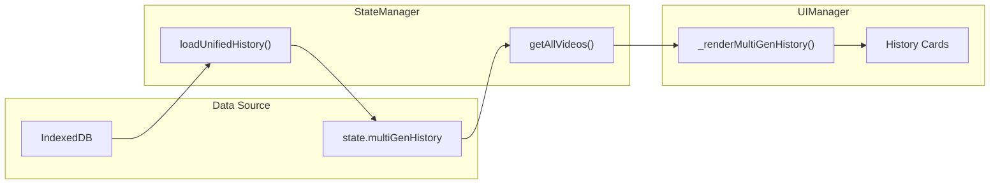
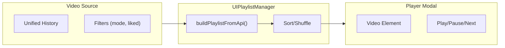

# Feature: History & Playlist (Tab 3)

**Version**: v1.21.24 (2025-12-20)
**User Interface**: The "History" tab in the extension overlay.
**Goal**: Manage and play back generated videos.

## History Tab Flow

## Playlist Player Flow

### v1.21.24 Updates (Session Fixes)
- **Favorites Playlist**: `playFromFavorites()` now always uses unified history (complete data) over paginated gallery API (~40 posts).
- **Consistent Video Counts**: Added base `videoUrl` and `moderated` filters to `buildPlaylistFromApi()` so image page and favorites show same count.
- **Performance**: Removed duplicate `_renderPlaylist()` call from `_loadVideo()` - now 1 render per video instead of 2.
- **All 9 player bugs documented in HANDOVER.md are fixed.**

### v1.20 Updates
- Playlist re-render now preserves the user's scroll position when videos advance; no auto-jump to the next item unless a sort/filter explicitly requests it.
- `/list` ingestion backfills parent image metadata and child video fields (URLs, prompts, model, resolution, timestamps, thumbnails) when enabled via `listIngestionEnabled`.

### Primary Manager: `UIPlaylistManager.js`
-   **Location**: `src/content/managers/ui/UIPlaylistManager.js`
-   **Responsibilities**:
    -   **Playlist Generation**: Builds playlists from the "Favorites" page or internal history.
    -   **Player Modal**: Creates a custom video player overlay.
    -   **Playback Controls**: Play, Pause, Next, Previous, Shuffle, Loop.
    -   **Scraping**: Can scrape video URLs from the DOM if API data is unavailable. **[LEGACY – DOM scraping disabled; API/backfill is the primary path]**
-   **Key Dependencies**:
    -   `ReactAutomation.js`: May be used to interact with the site's video elements.

### Persistence & Data Integrity
-   **Storage**: Multi-generation history is stored in the **Unified Store** (`unifiedHistory` in IndexedDB) to ensure persistence across reloads and account isolation.
-   **Known Issue**: Progress tracking for moderated videos may not persist correctly after reload (see `9_Unified_Storage_Architecture.md`).
-   **Critical Regression (v1.21.22+)**: The History UI may become "stale" (stop updating) during scrolling because the underlying data load is skipped for performance. See `HANDOVER.md` for the fix plan.
-   **Timestamp Handling**:
    -   Timestamps are derived from `updatedAt` or `createdAt` to prevent future-dating bugs.
    -   Hydration logic sanitizes timestamps (clamps to `Date.now()`) and backfills `lastSuccessAt` for legacy data.
-   **Sorting**:
    -   "Most Recent" sorting uses `finishedAt` or `startedAt` as a fallback if `timestamp` is missing.
    -   Sorting logic handles both ISO strings and numeric timestamps.
