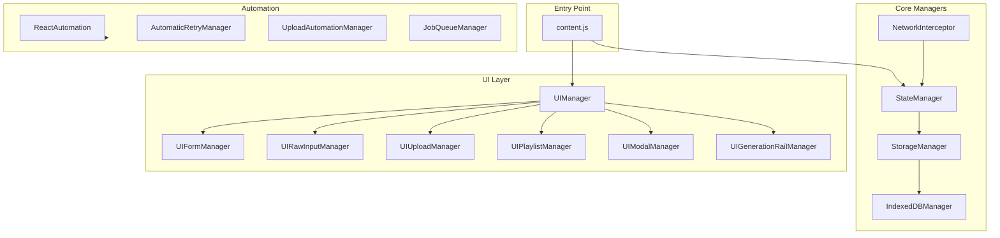

# Core Infrastructure & Shared UI

**Version**: v1.21.38 (2025-12-21)
**Goal**: Orchestrate the extension, manage state, and provide shared UI components.

## System Architecture



### Session Updates (2025-12-25) - v1.21.47
- **JobQueueManager (New)**: Background task manager for queuing persistent jobs (upscales, unlikes, relikes) that survive page reloads.
- **UIGenerationRailManager (New)**: Top-screen "rail" UI for monitoring Quick Raw executions in real-time, functioning behind the main extension UI.
- **React Compatibility**: `ReactAutomation.reactClick()` functionality centralized for reliable React element interaction, replacing native `.click()`.
- **Selector Centralization**: All DOM selectors moved to `src/content/constants/selectors.js` for easier maintenance.

### Session Updates (2025-12-21)
- **Named Prompt Slots (v1.21.38)**: Saved prompt slots now support custom names with inline editing. See `artifacts/2_RAW_Prompt.md`.
- **AutomaticRetryManager Triple Guard (v1.21.38)**: Fixed ghost retry issue with 3-layer protection:
  1. Page path check at function start (`/imagine`, `/chat/`, etc.)
  2. Page path re-check after delay (user may navigate during backoff)
  3. Textarea existence check before `sendToGenerator()` (Grok button clicks don't use textarea)

### Session Updates (2025-12-10)
- **Quick Video from Edit (v1.20.5)**: New 🎥 toggle button automates video generation from edited images. See `artifacts/6_Quick_Video_Feature.md` for full details.
- **Quick Edit (v1.20.4)**: 🖼 ImgEdit button automates image editing via `sendToImageEdit()` in ReactAutomation.js.

### Session Updates (2025-12-05)
- JSON presets: Create/update now keeps the name populated and focused in the preset input; warns if unnamed; auto-selects after save.
- Visual Details objects: Custom presets persist to IndexedDB; "Custom…" inline entry; object strings normalized to `Name: ` with colon + space.
- View JSON modal: Taller default (min ~640px, up to 90vh) with improved readability.
- Template normalization: Repairs missing `fieldPath`/name in stored templates to avoid skips.

### Main Orchestrator: `UIManager.js`
    -   **Initialization**: Instantiates all other UI managers.
    -   **Shadow DOM**: Creates and manages the extension's isolated DOM.
    -   **Global Events**: Listens for mode changes (Upload, Aurora, Wrap).
    -   **Toast Notifications**: Provides a central `showToast` method.

### State Management: `StateManager.js`
-   **Location**: `src/content/managers/StateManager.js`
-   **Responsibilities**:
    -   Centralized state store (presets, settings, history).
    -   **Unified Storage**: Manages the `unifiedHistory` store in IndexedDB (via `IndexedDBManager`).
    -   **Account Isolation**: Ensures data is strictly segregated by Account ID.
    -   **Persists data**: Uses IndexedDB for heavy data (videos) and Chrome Storage for settings.
    -   **Saved Prompt Slots**: Manages slot CRUD including `renameSavedPromptSlot()`.
    -   **[LEGACY] Gallery store**: Old gallery store persistence is superseded by Unified Storage and should not be re-enabled.

### Network & Automation: `NetworkInterceptor.js`
-   Intercepts Grok API traffic for video tracking.
-   **Retry Logic**: Integrates with `AutomaticRetryManager` for resilience.

### AutomaticRetryManager.js
-   **Location**: `src/content/managers/AutomaticRetryManager.js`
-   **Purpose**: Automatically retries moderated video generations.
-   **v1.21.38 Triple Guard**:
    1. Check page is video-capable before processing
    2. Re-check page after delay (user may navigate away)
    3. Verify textarea exists before calling `sendToGenerator()`
-   **Pages Considered Video-Capable**: `/chat/`, `/imagine`, `/imagine/post/`, home page

### Shared Components
-   **`UIModalManager.js`**: Centralized manager for all overlay dialogs.
    -   **Fullscreen Editor**: For editing long text fields (Motion, Visual Details).
    -   **Prompt History**: Shows past prompts for a specific image.
    -   **JSON Tools**: Modals for Viewing and Importing JSON presets.
    -   **Saved Prompts**: UI for managing RAW mode saved slots.
-   **`UITabManager.js`**: Manages the switching between JSON, RAW, Upload, and Playlist tabs.
-   **`UIStatusManager.js`**: Likely manages a status bar or global status indicators.
-   **`UIHelpers.js`**: Utility functions for DOM manipulation and common UI patterns.

## Directory Structure Reference
```
src/
├── content/
│   ├── managers/
│   │   ├── ui/                 # UI-specific Managers
│   │   │   ├── UIManager.js
│   │   │   ├── UIFormManager.js
│   │   │   ├── UIRawInputManager.js
│   │   │   ├── UIUploadManager.js
│   │   │   ├── UIPlaylistManager.js
│   │   │   ├── UIModalManager.js
│   │   │   ├── UITabManager.js
│   │   │   └── ...
│   │   ├── StateManager.js     # Data Persistence
│   │   ├── AutomaticRetryManager.js  # Auto-retry with triple guard
│   │   ├── UploadAutomationManager.js
│   │   ├── JobQueueManager.js    # Background job processing
│   │   └── ...
│   └── content.js              # Entry Point
```
