# Quick Video from Edit Feature

**Version**: v1.20.5 (2025-12-10)
**Goal**: Automate video generation from edited images with one-click workflow.

## Overview

The Quick Video feature (🎥 toggle button) allows users to automatically generate videos from edited images. When enabled and an edited image thumbnail is clicked, the extension:
1. Captures the RAW prompt text
2. Navigates to the edited image page
3. Enters the prompt into the video generation textarea
4. Clicks "Make video"
5. Returns to the original page using Escape key (no refresh)

## Workflow Diagram

```mermaid
sequenceDiagram
    participant User
    participant Gallery as Gallery Grid
    participant SM as StateManager
    participant RAM as ReactAutomation
    participant Grok as Grok UI

    User->>SM: Toggles "Quick Video" (🎥)
    SM-->>Gallery: Enable Quick Mode overlay

    User->>Gallery: Clicks on Edited Image Thumbnail
    Gallery->>RAM: checkQuickMode()
    RAM->>RAM: Extract prompt from alt text/metadata
    RAM->>Grok: Click Thumbnail (Navigate to Lightbox)
    
    Note over Grok: URL changes to /imagine/...

    RAM->>Grok: Wait for Video Textarea
    Grok-->>RAM: Textarea Ready
    RAM->>Grok: Inject Prompt & " --video"
    RAM->>Grok: Click "Make video" button

    Note over Grok: Video Generation Starts

    RAM->>Grok: Simulate ESC Key
    Grok-->>User: Returns to Gallery View
```

## Feature Components

### UI Components
- **🎥 Button**: Located in `imgEditActionsContainer` (next to Re-edit and Go Back buttons)
- **Toggle State**: Managed via `state.ui.quickVideoFromEdit` in StateManager
- **Visual Feedback**: Button has `.active` class when enabled (blue highlight)

### Automation Logic
- **File**: `ReactAutomation.js`
- **Function**: `handleImageClick(e)` interceptor
- **Guard**: Checks `if (state.ui.quickVideoFromEdit)`
