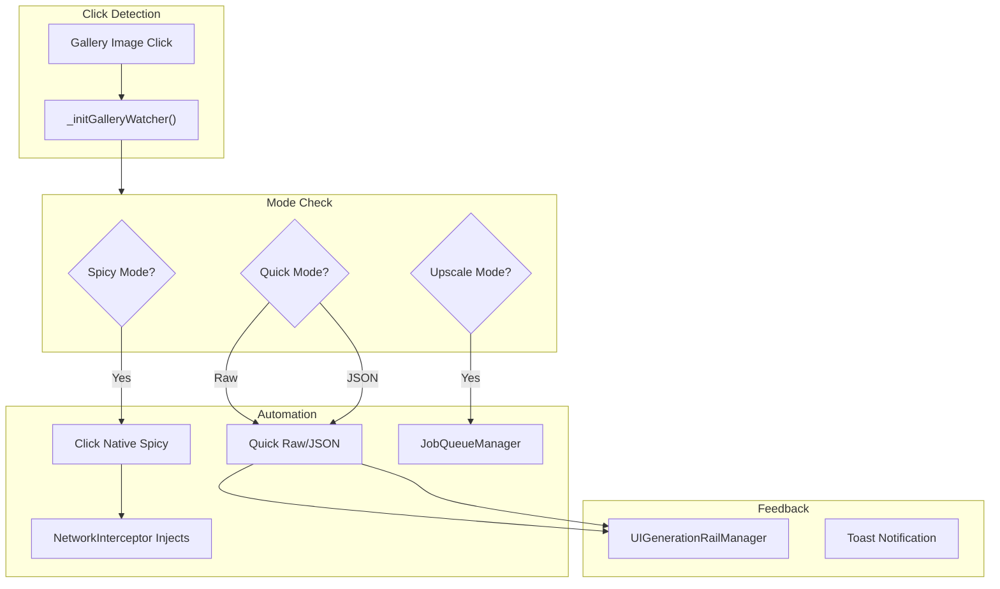

# Gallery Automation Features

**Version**: v1.21.44 (2025-12-25)
**Goal**: Automate video generation from gallery image clicks with one-click workflows.

## Gallery Automation Flow



## Overview

The Gallery Automation system provides three distinct automation modes that activate when clicking images in the Grok gallery (`/imagine`, `/imagine/favorites`, `/imagine/mine`):

1. **Spicy Mode** - Uses native Grok "Spicy" video button
2. **Quick Raw/JSON Mode** - Fills and submits extension prompts
3. **Upscale Mode** - Navigates to post page and triggers upscale menu

## Feature Matrix

| Mode | Activation | Target Galleries | Action | Return Behavior |
|------|------------|------------------|--------|-----------------|
| Spicy Mode | 🌶️ toggle | All galleries | Click native Spicy button | Auto-ESC to gallery |
| Quick Raw | RAW toggle | All galleries | Submit RAW tab prompt | Auto-ESC to gallery |
| Quick JSON | JSON toggle | All galleries | Submit JSON tab prompt | Auto-ESC to gallery |
| Upscale Mode | Upscale toggle | All galleries | Navigate → Upscale menu → Go back | History.back() |

## Spicy Mode (Native Spicy Automation)

### How It Works
1. User enables 🌶️ toggle in launcher
2. User clicks any image in gallery
3. Extension detects the native "Make video with presets" button
4. Clicks the "🌶️ Spicy" option from the dropdown menu
5. Waits for video generation to start
6. Simulates Escape key to return to gallery

### State Management
```javascript
// StateManager.js
state.generation.useSpicy: false       // Toggle state
state.generation.useNativeSpicy: false // Flag set when native spicy used
```

### Button Detection Logic (UIManager.js)

The extension uses a multi-method approach to find the trigger button:

1. **SVG Icon Detection**: Look for buttons containing `svg[class*="lucide-film"]` icon
2. **Aria-Label Fallback**: Buttons with `aria-label="Make video"`, `"Video Presets"`, etc.
3. **Menu Item Detection**: Once menu opens, find `[role="menuitem"]` containing "Spicy"

### Selector Breakdown
```javascript
const triggerSelectors = [
    'button[aria-label="Video Presets"]',
    'button[aria-label="Video Options"]',
    'button[aria-label="Make video"]',
    'button[aria-label="Make a video"]',
    'button[data-testid="video-generator-submit"]'
];
```

### Button Click Method (v1.21.44+)

The extension uses `ReactAutomation.reactClick()` for consistent React-compatible clicking:

```javascript
// Use ReactAutomation's reactClick for consistent React-compatible clicking
if (window.gvpReactAutomation?.reactClick) {
    window.gvpReactAutomation.reactClick(triggerButton, 'Native Spicy Button');
} else {
    console.warn('[GVP Spicy] ReactAutomation not available, using native click');
    triggerButton.click();
}
```

**Benefits:**
- Consistent with other React UI automation (Quick Raw/JSON, Upscale, etc.)
- Properly triggers React's internal event handlers
- Automatic fallback to native `.click()` if ReactAutomation unavailable

### Key Methods (UIManager.js)
| Method | Purpose |
|--------|---------|
| `toggleSpicyMode()` | Toggle spicy state and return new value |
| `_initGalleryWatcher()` | Attach click listener to document for gallery images |
| `_handleGalleryImageOpened()` | Route to correct automation (spicy vs quick) |
| `_detectNativeSpicyButton()` | Find and click the trigger button |
| `_findVideoTriggerButton()` | Shared button detection logic |
| `_returnToGallery({reason})` | Unified return-to-gallery logic |

---

## Quick Raw/JSON Mode

### How It Works
1. User activates "Quick Raw" or "Quick JSON" toggle in launcher
2. User clicks any image in gallery
3. Extension immediately calls `_triggerQuickGeneration()`
4. This invokes `handleGenerateRaw()` or `handleGenerateJson()` from respective managers
5. Prompt is submitted to Grok
6. Extension simulates Escape to return to gallery

### State Management
```javascript
// StateManager.js
state.ui.quickLaunchMode: 'raw' | 'json' | null  // Active quick mode
```

### Toggle Logic (UIManager.js)
```javascript
// Quick Raw button
onClick: () => {
    const newState = this.toggleQuickLaunchMode('raw');
    this.showToast(newState ? 'Quick Raw Enabled' : 'Quick Raw Disabled');
}

// Quick JSON button
onClick: () => {
    const newState = this.toggleQuickLaunchMode('json');
    this.showToast(newState ? 'Quick JSON Enabled' : 'Quick JSON Disabled');
}
```

### Key Methods
| Method | Location | Purpose |
|--------|----------|---------|
| `toggleQuickLaunchMode(mode)` | UIManager.js | Set/clear quick launch mode |
| `_triggerQuickGeneration()` | UIManager.js | Execute generation based on mode |
| `handleGenerateRaw({allowEmpty})` | UIRawInputManager.js | Submit RAW prompt |
| `handleGenerateJson({allowEmpty})` | UIFormManager.js | Generate and submit JSON prompt |

### Precedence Rules
When both Spicy Mode and Quick Mode are enabled:
- **Quick Mode takes precedence** (checked first in `_handleGalleryImageOpened`)
- Spicy automation is skipped when Quick mode is active

---

## Upscale Mode (UIUpscaleAutomationManager)

### How It Works
1. User enables Upscale toggle
2. User clicks video in gallery
3. Extension navigates to post page (`/imagine/post/{id}`)
4. Automation loop starts:
   - Step 0: Click "More options" button
   - Step 1: Click "Upscale video" menu item
   - Step 2: Wait 1 second, press Escape
   - Step 3: Go back to gallery

### State Management
```javascript
// Managed via sessionStorage (ephemeral)
sessionStorage.getItem('gvp_ui_upscale_active') === 'true'
```

### Key Methods (UIUpscaleAutomationManager.js)
| Method | Purpose |
|--------|---------|
| `toggle(force)` | Enable/disable upscale mode |
| `start()` | Attach gallery listeners and mutation observer |
| `stop()` | Disconnect observer |
| `_attachGalleryListeners()` | Find video elements and attach click handlers |
| `_handleClick(e)` | Navigate to post page on video click |
| `_runAutomationLoop()` | Step-based automation (0→1→2→3) |
| `_reactClick(element)` | Use ReactAutomation or fallback click |

---

## Return-to-Gallery Logic (Unified)

All automation modes use a standardized return mechanism:

### Method: `_returnToGallery(options = {})`

```javascript
async _returnToGallery(options = {}) {
    const { delay = 600, reason = 'automation' } = options;
    
    const isAutomationReturn = ['quick-launch', 'native-spicy'].includes(reason);
    
    if (isAutomationReturn) {
        // Always proceed for known automation reasons
        setTimeout(async () => {
            await this._attemptImageDetailClose(reason);
            if (!this._wasDetailClosed) {
                await this._simulateEscapeToGallery(reason);
            }
        }, delay);
    }
}
```

### Close Detection Methods
1. **`_attemptImageDetailClose()`**: Look for close/X button and click it
2. **`_simulateEscapeToGallery()`**: Dispatch Escape keydown event

### Selectors for Close Button
```javascript
const closeSelectors = [
    'button[aria-label="Close"]',
    'button[aria-label="close"]',
    'button[data-testid="close-button"]',
    'div[role="dialog"] button:has(svg[class*="x"])'
];
```

---

## Gallery Watcher Initialization

The gallery watcher is initialized in `UIManager._initGalleryWatcher()`:

```javascript
_initGalleryWatcher() {
    document.addEventListener('click', async (e) => {
        // Check if click is on a gallery image
        const imageCard = e.target.closest('[data-testid="media-card"]') ||
            e.target.closest('article') ||
            e.target.closest('a[href*="/imagine/post/"]');
            
        if (!imageCard) return;
        
        // Check if any automation mode is active
        const state = this.stateManager.getState();
        const quickMode = state.ui?.quickLaunchMode;
        const spicyMode = state.generation?.useSpicy;
        
        if (!quickMode && !spicyMode) return;
        
        // Wait for image detail to open, then handle
        setTimeout(() => this._handleGalleryImageOpened(), 800);
    });
}
```

---

## File Locations

| File | Purpose |
|------|---------|
| `src/content/managers/UIManager.js` | Main automation orchestration (lines 3541-5580) |
| `src/content/managers/ui/UIUpscaleAutomationManager.js` | Dedicated upscale automation (244 lines) |
| `src/content/managers/StateManager.js` | State for toggles |
| `src/content/managers/ui/UIFormManager.js` | JSON generation handler |
| `src/content/managers/ui/UIRawInputManager.js` | RAW generation handler |

---

## Design Decisions

1. **Quick Mode Priority**: Quick Raw/JSON takes precedence over Spicy Mode to prevent conflicts
2. **Direct Generation**: Quick modes call `_triggerQuickGeneration()` directly rather than opening UI
3. **Unified Return**: All modes use `_returnToGallery()` for consistent behavior
4. **Origin Agnostic**: Automation works on all gallery pages (favorites, mine, main imagine)
5. **Rate-Limit Safe**: Ingestion skipping prevents DB lock during rapid navigation

---

## Known Limitations

1. **Element Timing**: Button detection may fail if Grok UI is slow to load
2. **CloudFlare**: Rapid automation may trigger human verification
3. **Menu Changes**: Grok UI updates may break selector-based detection
4. **Single Mode**: Only one quick mode (Raw OR JSON) can be active at a time

---

## Version History

| Version | Date | Changes |
|---------|------|---------|
| v1.21.47 | 2025-12-25 | Introduced `JobQueueManager` for background task processing (upscale/unlike) |
| v1.21.47 | 2025-12-25 | Added `UIGenerationRailManager` for real-time generation status tracking |
| v1.21.44 | 2025-12-25 | Upgraded spicy button click to use `reactClick` instead of multi-method chain |
| v1.21.37 | 2025-12-21 | Fixed Quick Raw/JSON trigger for `data:image` URLs on gallery pages |
| v1.21.36 | 2025-12-20 | Fixed UUID extraction - image ID (2nd) instead of account ID (1st) from /users/ URLs |
| v1.21.30 | 2025-12-20 | Added Quick Mode precedence guard - Spicy skips if Quick active |
| v1.21.29 | 2025-12-20 | Fixed suppression flag never clearing in finally block |
| v1.21.28 | 2025-12-20 | Removed duplicate quick-launch from UIManager - content.js sole handler |
| v1.21.1 | 2025-12-11 | Fixed `_checkPage` error in UIUpscaleAutomationManager |
| v1.21.1 | 2025-12-11 | Fixed Quick Raw/JSON flow to call `_triggerQuickGeneration()` directly |
| v1.21.0 | 2025-12-10 | Standardized return logic with `_returnToGallery()` |
| v1.20.5 | 2025-12-09 | Added Spicy Mode automation for favorites gallery |
| v1.20.3 | 2025-12-04 | Initial gallery watcher implementation |

