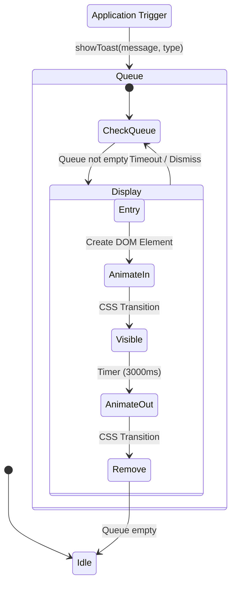

# Toast Notification System

**Version**: v1.21.39 (2025-12-22)
**Goal**: Provide consistent user feedback for all actions via toast notifications.

## Overview

The extension uses a unified Toast Notification System to provide immediate visual feedback for all user-triggered actions. The primary method is `showToast()` in UIManager.js.

## Toast Logic Flow



## Toast API Reference

### Primary Method (UIManager.js)

```javascript
// Standard toast
showToast(message, type = 'info', duration = 3000)

// Types: 'info' | 'success' | 'warning' | 'error'
```

### Usage Examples

1. **Success**: `this.showToast('Settings saved successfully', 'success')`
2. **Error**: `this.showToast('Failed to generate prompt', 'error')`
3. **Info**: `this.showToast('Processing queue...', 'info')`

## Implementation Details

- **Container**: `.gvp-toast-container` (Fixed position, **top-center** at 80px from top)
- **Stacking**: New toasts appear at top, pushing older toasts down (`flex-direction: column-reverse`)
- **Animation**: Slide-down entry (`translateY(-20px) → translateY(0)`)
- **Cleanup**: DOM elements are removed immediately after animation completes to prevent DOM bloat

## Version History

| Date | Version | Change |
|------|---------|--------|
| 2025-12-22 | v1.21.39 | Changed position from bottom-center to **top-center** (80px from top) |
| 2025-12-11 | v1.21.1 | Initial toast system implementation |

